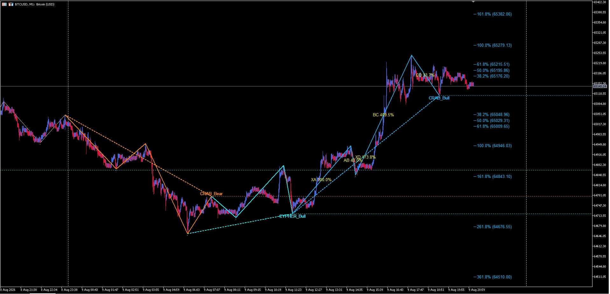
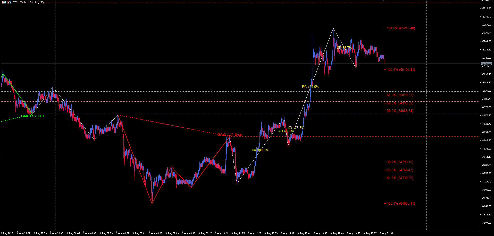

# Harmonic Patterns SwingCore - For MetaTrader 5 (MT5)

Technical analysis indicator for detecting and visualizing harmonic patterns on the chart timeframe M1, with Fibonacci level projection and configurable alert system.

---

## What This Indicator Is

It is a **visual analysis tool**. Its function is to identify structures on the chart that satisfy the geometric relationships of six classic harmonic patterns — Gartley, Bat, Butterfly, Crab, Cypher, and Shark — in both bullish and bearish variants, and to display them clearly along with their projection levels.

The indicator draws the pattern legs, labels the completion point, projects Fibonacci retracement and extension levels from the most recent pattern, and can raise an alert when a new one is detected.

---

## What This Indicator Is "NOT"

- **Not an automated trading system.** Does not open, close, or manage positions.
- **Not a buy/sell signal generator.** Displays geometric structures; interpretation and any decision rest entirely with the user.
- **Not a price predictor.** Fibonacci levels are geometric projection references, not forecasts.
- **Not a guarantee of any particular outcome.** A harmonic pattern is a technical-analysis figure, and its appearance does not imply a result.

---

## The Real Problem: Detecting Structure, Not Measuring the Pattern

It is worth being transparent about where the real technical difficulty of this kind of indicator lies.

Measuring a harmonic pattern — checking whether the proportions between its legs are close to the Fibonacci ratios — is, at bottom, straightforward arithmetic. That is **not** the hard part.

The hard part, and where most detectors fail, is the step before it: **identifying what is a genuinely relevant peak and valley in real time**, especially on low timeframes such as M1, where price noise is considerable.

Here there is no single, objective answer. Detecting significant highs and lows depends on several parameters (sensitivity, observation window, minimum prominence, separation between extremes) and can be approached with different mathematical models, each with its own trade-offs:

- If the detector is **too sensitive**, it marks noise as if it were real turning points and produces spurious patterns.
- If it is **too coarse**, it misses valid structures.

The central question — *how much smoothing is adequate and how much is excessive* — has no universally correct solution. It is an inherently subjective problem, and any honest detector is, in reality, a position taken on that balance.

---

## The Approach Behind This Indicator

This indicator addresses that difficulty with an **empirical and alternative** method of identifying price structure: empirical because its configuration is derived from observation on real data, and alternative because it is one of several possible paths to solve a problem that, as explained, admits no single solution.

Building it required integrating several disciplines:

- **Signal processing**, to treat the price series before searching for extremes and reduce the impact of noise.
- **Analytic geometry**, since each pattern is a set of spatial relationships between five points.
- **Proportions and metric relationships** (the Fibonacci ratios) as the validation criterion between legs.
- **Combinatorial validation logic**: strict peak-valley alternation, and verification of the geometric inequalities specific to each pattern.

The result is a pipeline that first resolves the swing structure and only then applies pattern measurement on that already-refined structure.

---

## Brief Historical Context

Harmonic patterns have a long tradition in technical analysis. Their origin is usually traced to the work of H. M. Gartley (1935), and they were later formalized with Fibonacci proportions by subsequent authors, among them Scott Carney, who systematized several of the patterns now considered standard (such as the Bat, Crab, and Shark). The technique, therefore, has decades of history.

What has changed in recent years is the attempt to automate this reading on low timeframes, where — as described above — reliable detection of price structure becomes the true bottleneck.

---

## Versions

### LITE (Free)
- 1 pattern at a time among Gartley, Bat, Butterfly, Crab, Cypher, and Shark.
- Classic Detection Method only.
- Pattern and ZigZag Visualization.
- Percentage Labels on Chart.
- Fibonacci Targets Direct and Inverse: (38.2/50.0/61.8/100.0/161.8/261.8/361.8%).
- Basic Alerts (Visual + Sound).

### PRO (Paid)
- **6 patterns simultaneously: Gartley, Bat, Butterfly, Crab, Cypher, and Shark.**
- **Classic Detection Method.**
- **Geometric Detection Method.**
- Pattern and ZigZag Visualization.
- Percentage Labels on Chart.
- Fibonacci Targets Direct and Inverse: (38.2/50.0/61.8/100.0/161.8/261.8/361.8%).
- Basic Alerts (Visual + Sound).

---

### Comparison: Classic vs Geometric

| Aspect | Classic Method | Geometric Method |
|--------|---------------|-------------------|
| **Base** | Fibonacci Ratios | Order Relationships |
| **Validation** | Numerical Proportions | Order Conditions |
| **Tolerance** | Adjustable Parameter | Geometric Conditions |
| **Availability** | LITE and PRO | **PRO ONLY** |

---

## CLASSIC
---

## GEOMETRIC
---

- Detection of 6 harmonic patterns (Gartley, Bat, Butterfly, Crab, Cypher, Shark), bullish and bearish.
- Drawing of pattern legs and label at the completion point.
- Projection of Fibonacci levels (retracements and extensions) from the most recent pattern.
- **Two selectable validation methods:**
  - **Classic:** based on Fibonacci ratios (**available in LITE and PRO**)
  - **Geometric:** based on price structure (**PRO ONLY**)
- Configurable alert system, with adjustable number of repetitions.
- Visualization of swing structure on the chart.

---

## Technical Features

- **Data Source:** Heiken Ashi candles (price smoothing).
- **Structure Detection:** minimum prominence + minimum distance between extremes + forced peak-valley alternation.
- **Validation:** classic ratios or geometric rules, depending on the selected method.
- **Identification System:** time-based signature (datetime) that prevents repainting of the detected pattern.
- **Alerts:** Configurable alert system with repetition control.
- **Fibonacci Projection:** up to 7 levels, in both directions (retracement and extension).

---

## Main Parameters

### General
- Activation of detection and validation method.
- Ratio tolerance (0.15 by default).
- Scan window (1440 bars).

### Structure
- Minimum prominence (2.0).
- Harmonic Tolerance (0.15).

### Visualization
- Show/hide percentages.
- Horizontal lines from D.
- Fibonacci levels.

### Alerts
- Activation.
- Number of repetitions (5 by default).

---

## Alert System

| Channel | Description | Configuration |
|---------|-------------|---------------|
| **1. Visual** | Pop-up in MT5 terminal | `Alert_Visual = true` |
| **2. Sound** | WAV file playback | `Alert_Sonido = true` |
| **3. Log** | Registration in Experts tab | `Alert_Log = true` |

---

## Disclaimer

This indicator is provided **exclusively for informational and demonstrative purposes**, as a technical-analysis support tool.

It does not constitute financial, investment advice, or any trading recommendation. Pattern detection is the result of a geometric calculation and does not represent a prediction of future market behavior.

Past performance does not guarantee future results. Trading in financial markets carries a high risk of loss.

**You assume the entire risk of any decision you make based on this indicator.** The author is not responsible for any losses, damages, or harm of any kind resulting from its use.

---

## Contact

| Contact | Detail |
|---------|--------|
| **Author** | Nestor Mendez |
| **Email** | nestor.boza@gmail.com |

---

*Version: 1.0 | Last Updated: August 2026 | Copyright © 2026, Nestor Mendez*
