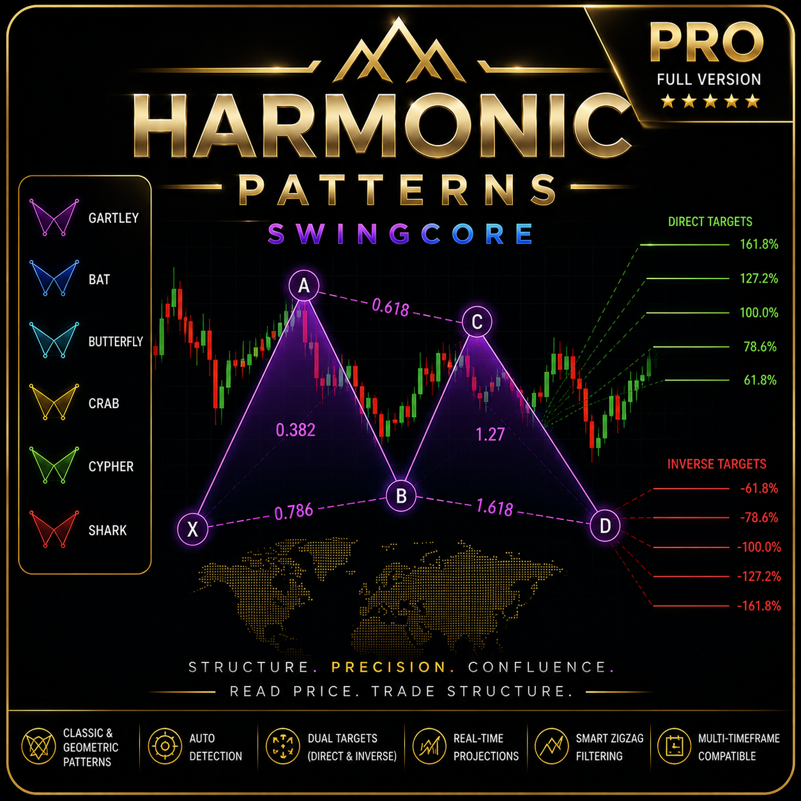

# Harmonic Patterns SwingCore - Para Meta Trader 5 (MT5)

Indicador de análisis técnico para la detección y visualización de patrones armónicos sobre el gráfico, con proyección de niveles de Fibonacci y sistema de alertas configurable.

---

## Qué es este indicador

Es una **herramienta de análisis visual**. Su función es identificar en el gráfico estructuras que cumplen las relaciones geométricas de seis patrones armónicos clásicos —Gartley, Bat, Butterfly, Crab, Cypher y Shark— en sus variantes alcista y bajista, y representarlas de forma clara junto con sus niveles de proyección.

El indicador dibuja los segmentos del patrón, etiqueta el punto de finalización, proyecta niveles de retroceso y extensión de Fibonacci a partir del patrón más reciente, y puede emitir una alerta cuando se detecta uno nuevo.

---

## Qué "NO" es este indicador

- **No es un sistema de trading automático.** No abre, cierra ni gestiona operaciones.
- **No genera señales de compra o venta.** Muestra estructuras geométricas; la interpretación y cualquier decisión corresponden por completo al usuario.
- **No predice el precio.** Los niveles de Fibonacci son referencias de proyección geométrica, no pronósticos.
- **No garantiza que un patrón detectado se resuelva de ninguna manera concreta.** Un patrón armónico es una figura de análisis técnico, y su aparición no implica un resultado.

---

## El problema real: detectar la estructura, no medir el patrón

Conviene ser transparente sobre dónde reside la dificultad técnica de este tipo de indicadores.

Medir un patrón armónico —comprobar si las proporciones entre sus segmentos se acercan a los ratios de Fibonacci— es, en el fondo, aritmética directa. Esa **no** es la parte difícil.

La parte difícil, y donde la mayoría de los detectores fallan, es el paso previo: **identificar qué es un pico y qué es un valle verdaderamente relevante en tiempo real**, especialmente en marcos temporales bajos como M1, donde el ruido de precio es considerable.

Aquí no existe una respuesta única y objetiva. La detección de máximos y mínimos significativos depende de varios parámetros (sensibilidad, ventana de observación, prominencia mínima, separación entre extremos) y puede abordarse con distintos modelos matemáticos, cada uno con sus propias concesiones:

- Si el detector es **demasiado sensible**, marca ruido como si fueran giros reales y produce patrones espurios.
- Si es **demasiado grueso**, pasa por alto estructuras válidas.

La pregunta central —*cuánto suavizado es adecuado y cuánto es excesivo*— no tiene una solución universalmente correcta. Es un problema intrínsecamente subjetivo, y cualquier detector honesto es, en realidad, una toma de posición sobre ese equilibrio.

---

## El enfoque de este indicador

Este indicador aborda esa dificultad con un método **empírico y alternativo** de identificación de la estructura de precio: empírico porque su configuración se deriva de la observación sobre datos reales, y alternativo porque es uno de los varios caminos posibles para resolver un problema que, como se explicó, no admite una única solución.

Construirlo implicó integrar varias disciplinas:

- **Procesamiento de señal**, para tratar la serie de precio antes de buscar extremos y reducir el impacto del ruido.
- **Geometría analítica**, ya que cada patrón es un conjunto de relaciones espaciales entre cinco puntos.
- **Proporciones y relaciones métricas** (los ratios de Fibonacci) como criterio de validación entre segmentos.
- **Lógica de validación combinatoria**: alternancia estricta de picos y valles, y comprobación de las desigualdades geométricas propias de cada patrón.

El resultado es un pipeline que primero resuelve la estructura de swings y solo después aplica la medición de patrones sobre esa estructura ya depurada.

---

## Breve contexto histórico

Los patrones armónicos tienen una larga tradición en el análisis técnico. Su origen suele situarse en el trabajo de H. M. Gartley (1935), y fueron formalizados con proporciones de Fibonacci por autores posteriores, entre ellos Scott Carney, quien sistematizó varios de los patrones que hoy se consideran estándar (como Bat, Crab y Shark). La técnica, por tanto, tiene décadas de recorrido.

Lo que ha cambiado en los últimos años es el intento de automatizar esta lectura en marcos temporales bajos, donde —como se ha descrito— la detección fiable de la estructura de precio se convierte en el verdadero cuello de botella.

---

## Versiones: 

### LITE (gratuita)
- 1 patrón a la vez entre Gartley, Bat, Butterfly, Crab, Cypher y Shark.
- Disponible solo Método Clásico | (Método Geométrico Bloqueado).
- Pattern and ZigZag Visualization
- Percentage Labels on Chart
- Fibonacci Targets Direct and Inverse:(38.2/50.0/61.8/100.0/161.8/261.8/361.8%)
-  Basic Alerts (Visual + Sound)
  
### PRO (de pago)
- **6 patrones simultáneamente: Gartley, Bat, Butterfly, Crab, Cypher y Shark.**
- **Motor Clásico** 
- **Motor Geométrico**
-  Pattern and ZigZag Visualization
- Percentage Labels on Chart
- Fibonacci Targets Direct and Inverse:(38.2/50.0/61.8/100.0/161.8/261.8/361.8%)
-  Basic Alerts (Visual + Sound)
---

## Parámetros principales

### Generales
- Activación de la detección y método de validación.
- Tolerancia de ratios (0.15 por defecto).
- Ventana de escaneo (1440 barras).

### Estructura
- Prominencia mínima (2.0).

### Visualización
- Mostrar/ocultar porcentajes.
- Líneas horizontales desde D.
- Niveles de Fibonacci.

### Alertas
- Activación.
- Número de repeticiones (5 por defecto).

---

## Sistema de alertas 

| Canal | Descripción | Configuración |
|---|---|---|
| **1. Visual** | Pop-up en el terminal MT5 | `Alert_Visual = true` |
| **2. Sonido** | Reproducción de archivo WAV | `Alert_Sonido = true` |
| **3. Log** | Registro en la pestaña Expertos | `Alert_Log = true` |

---

## Aviso de responsabilidad

Este indicador se ofrece **exclusivamente con fines informativos y demostrativos**, como herramienta de apoyo al análisis técnico.

No constituye asesoría financiera, de inversión ni recomendación de operación alguna. La detección de patrones es el resultado de un cálculo geométrico y no representa una predicción del comportamiento futuro del mercado.

El rendimiento pasado no garantiza resultados futuros. La operación en mercados financieros conlleva un riesgo elevado de pérdida.

**Usted asume la totalidad del riesgo derivado de cualquier decisión que tome con base en este indicador.** El autor no se hace responsable de pérdidas, daños o perjuicios de ningún tipo resultantes de su uso.

---

## Contacto

| Contacto | Detalle |
|----------|---------|
| **Autor** | Nestor Mendez |
| **Email** | nestor.boza@gmail.com |

---

*Versión: 1.0 | Última actualización: Agosto 2026 | Copyright © 2026, Nestor Mendez*

